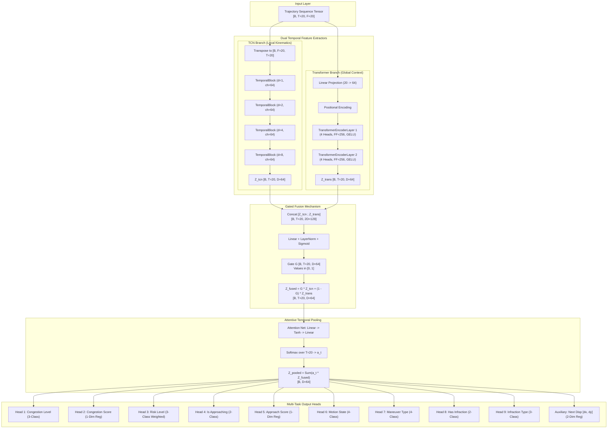

# PHASE 5: MODEL ARCHITECTURE SPECIFICATION
## Proposed TCN-Transformer Gated Hybrid Architecture

**Project:** Intelligent Traffic Management & Vehicle Trajectory Analytics  
**Component:** Deep Learning Sequence Backbone & Multi-Task Predictor  
**Date:** September 2026  
**Status:** Architecture Implemented & Validated  
**Note:** This architecture is designated as the *"Proposed TCN-Transformer Gated Hybrid Architecture"*. Scientific novelty is not claimed pending comparative empirical benchmark evaluation.

---

## 1. Architectural Overview & Design Motivation

Vehicle trajectories and traffic dynamics exhibit a dual temporal nature:
1. **High-Frequency Local Kinematics:** Instantaneous acceleration fluctuations, micro-steering variations, and localized stop-and-go jerks occur over narrow time horizons ($1$ to $5$ frames, $30$–$150\text{ ms}$).
2. **Low-Frequency Global Trends:** Macro-traffic congestion buildup, lane changes, sustained approaching maneuvers, and regulatory infractions span broader context windows ($10$ to $20+$ frames, $0.3$–$1.0+\text{ s}$).

Pure Recurrent Neural Networks (LSTMs/GRUs) suffer from sequential computation bottlenecks and struggle to balance both scales simultaneously. Pure Transformers excel at pairwise global relationships but often fail to model local temporal order without extensive data. Pure CNNs (TCNs) capture local hierarchical patterns efficiently but have fixed receptive field horizons.

To address these dual phenomena, the **Proposed TCN-Transformer Gated Hybrid Architecture** combines a **Temporal Convolutional Network (TCN) branch** with a **Transformer Encoder branch**, fusing their representations via a **learnable element-wise gating mechanism**, followed by **attentive temporal pooling** and **task-specific multi-objective heads**.

---

## 2. End-to-End Tensor Flow & Architecture Diagram

---

## 3. Detailed Component Breakdown

### A. Input Layer
- **Input Tensor Shape:** $\mathbf{X} \in \mathbb{R}^{B \times T \times F}$
  - $B$: Batch size (e.g. 64)
  - $T$: Sequence length ($20$ timesteps, equivalent to $\approx 0.667\text{ s}$ at 30 FPS)
  - $F$: Feature dimension ($20$ kinematic and physical measurements discovered in Phase 5 audit)
- **Flexibility:** Both $T$ and $B$ are fully dynamic. Features are projected via linear or convolutional layers, avoiding hard-coded shapes.

---

### B. Temporal Convolutional Network (TCN) Branch
The TCN branch focuses on extracting localized, stationary temporal correlations and high-frequency velocity changes.

#### 1. Causal Dilated Convolutions
To ensure strict temporal validity (no future frame information leaking into past predictions), the branch employs **causal 1D convolutions**:
$$\text{Padding} = (K - 1) \times d$$
where $K$ is kernel size ($3$) and $d$ is the dilation rate.

#### 2. Receptive Field Expansion
With dilation rates $\mathbf{d} = [1, 2, 4, 8]$ and kernel size $K = 3$, the effective receptive field is:
$$R = 1 + 2 \times (K - 1) \times \sum_{i=1}^L d_i = 1 + 2 \times (3 - 1) \times (1 + 2 + 4 + 8) = 1 + 4 \times 15 = 61 \text{ timesteps}$$
Since $R = 61 > T = 20$, the TCN easily covers the entire 20-frame historical window while preserving sharp local gradients.

#### 3. Residual TemporalBlock
Each block features:
$$\mathbf{z}^{(l)} = \text{GELU}\left(\text{Conv1D}_2\left(\text{Dropout}\left(\text{GELU}\left(\text{BatchNorm}\left(\text{Conv1D}_1\left(\mathbf{z}^{(l-1)}\right)\right)\right)\right)\right) + \mathcal{W}_{\text{res}}\mathbf{z}^{(l-1)}\right)$$
where $\mathcal{W}_{\text{res}}$ is a $1 \times 1$ convolution matching channel dimensions when necessary.

---

### C. Transformer Encoder Branch
The Transformer branch models all-to-all temporal dependencies, discovering long-range interactions across the sequence.

#### 1. Input Projection & Positional Encoding
Features $\mathbf{x}_t \in \mathbb{R}^F$ are projected to hidden dimension $D$:
$$\mathbf{h}_t^{(0)} = \mathbf{W}_{\text{in}}\mathbf{x}_t + \mathbf{b}_{\text{in}} + \mathbf{PE}(t)$$
where $\mathbf{PE}(t)$ uses sinusoidal positional encoding:
$$\mathbf{PE}_{(t, 2i)} = \sin\left(\frac{t}{10000^{2i/D}}\right), \quad \mathbf{PE}_{(t, 2i+1)} = \cos\left(\frac{t}{10000^{2i/D}}\right)$$

#### 2. Multi-Head Self-Attention
With $H=4$ attention heads, the attention scores capture temporal relationships across all frame pairs $(i, j)$:
$$\text{Attention}(\mathbf{Q}, \mathbf{K}, \mathbf{V}) = \text{softmax}\left(\frac{\mathbf{Q}\mathbf{K}^T}{\sqrt{d_k}}\right)\mathbf{V}$$

#### 3. Feed-Forward Network & Pre-LayerNorm
Uses pre-layer normalization (`norm_first=True`) for stable convergence, expanding hidden dimension from $D=64$ to $D_{\text{ff}}=256$ with GELU activations.

---

### D. Learnable Gated Fusion Mechanism
Rather than naive concatenation (which inflates parameter counts and forces downstream layers to segregate features) or simple addition (which assumes equal utility), we implement an element-wise adaptive gate:

$$\mathbf{G} = \sigma\left(\mathbf{W}_g [\mathbf{Z}_{\text{tcn}} \,;\, \mathbf{Z}_{\text{trans}}] + \mathbf{b}_g\right) \in [0, 1]^{B \times T \times D}$$
$$\mathbf{Z}_{\text{fused}} = \mathbf{G} \odot \mathbf{Z}_{\text{tcn}} + (1 - \mathbf{G}) \odot \mathbf{Z}_{\text{trans}} \in \mathbb{R}^{B \times T \times D}$$

- When $\mathbf{G} \to 1$: Model prioritizes short-term high-frequency TCN kinematics (e.g. sudden braking).
- When $\mathbf{G} \to 0$: Model prioritizes long-range Transformer contextual patterns (e.g. steady congestion trends).
- The gating is dynamic per feature channel and per timestep.

---

### E. Attentive Temporal Pooling
Traditional sequence flattening ($\mathbf{Z} \to \mathbb{R}^{B \times (T \cdot D)}$) destroys temporal invariance and creates excessive parameter overhead. Simple mean pooling treats frame $t=1$ with identical weight as the critical final decision frame $t=20$.

The attentive pooling layer computes a normalized importance weight $a_t$ for each frame:
$$u_t = \mathbf{w}_a^T \tanh(\mathbf{W}_a \mathbf{z}_t^{\text{fused}} + \mathbf{b}_a)$$
$$a_t = \frac{\exp(u_t)}{\sum_{\tau=1}^T \exp(u_\tau)}$$
$$\mathbf{z}_{\text{pooled}} = \sum_{t=1}^T a_t \mathbf{z}_t^{\text{fused}} \in \mathbb{R}^{B \times D}$$

This enables the model to focus primarily on recent frames while incorporating historical context.

---

### F. Multi-Task Output Heads
Each target has a dedicated lightweight projection head comprising:
$$\text{Head}_i(\mathbf{z}_{\text{pooled}}) = \mathbf{W}_2^{(i)} \left(\text{Dropout}\left(\text{GELU}\left(\text{LayerNorm}\left(\mathbf{W}_1^{(i)} \mathbf{z}_{\text{pooled}} + \mathbf{b}_1^{(i)}\right)\right)\right)\right) + \mathbf{b}_2^{(i)}$$

| Target Name | Head Type | Output Dim | Loss Formulation |
| :--- | :--- | :---: | :--- |
| `target_congestion_level` | Classification | 3 | CrossEntropyLoss |
| `target_congestion_score` | Regression | 1 | Smooth L1 Loss (Huber) |
| `target_risk_level` | Classification | 3 | Weighted CrossEntropyLoss ($w=[0.47, 6.31, 1.43]$) |
| `target_is_approaching` | Classification | 2 | CrossEntropyLoss |
| `target_approach_score` | Regression | 1 | Smooth L1 Loss (Huber) |
| `target_motion_state` | Classification | 4 | Weighted CrossEntropyLoss ($w=[1.04, 1.31, 0.79, 54.27]$) |
| `target_maneuver_type` | Classification | 4 | CrossEntropyLoss ($w=[1.04, 4.60, 4.31, 0.63]$) |
| `target_has_infraction` | Classification | 2 | CrossEntropyLoss / BCE |
| `target_infraction_type` | Classification | 3 (Active: 0, 1) | CrossEntropyLoss (Class 2 masked) |
| `aux_next_displacement` | Regression | 2 | Smooth L1 Loss |

---

## 4. Multi-Task Loss Formulation

The loss module supports two operational modes:

### Mode 1: Static Configurable Weighted Loss (Default)
$$\mathcal{L}_{\text{total}} = \sum_{i=1}^M w_i \mathcal{L}_i$$
where weights $w_i$ are configured in `configs/phase5_config.yaml`.

### Mode 2: Homoscedastic Uncertainty Weighting (Kendall & Gal, 2018)
To avoid manual hyperparameter tuning of multi-task loss scales, each task learns an observation noise parameter $s_i = \log \sigma_i^2$:
$$\mathcal{L}_{\text{total}} = \sum_{i \in \text{Regression}} \left( \frac{1}{2}\exp(-s_i) \mathcal{L}_i + \frac{1}{2}s_i \right) + \sum_{j \in \text{Classification}} \left( \exp(-s_j) \mathcal{L}_j + \frac{1}{2}s_j \right)$$
As task error decreases, the model automatically increases precision $\exp(-s_i)$, balancing gradient contributions organically.

---

## 5. Parameter Count & Memory Footprint

| Architectural Component | Layer Specifications | Parameter Count | % of Model |
| :--- | :--- | :---: | :---: |
| **TCN Branch** | 4 Residual Dilated Blocks ($K=3, d \in [1, 2, 4, 8]$) | 92,736 | 40.8% |
| **Transformer Branch** | Linear Projection + 2 Encoder Layers ($H=4, D_{\text{ff}}=256$) | 101,440 | 44.7% |
| **Gated Fusion** | Linear($128 \to 64$) + LayerNorm + Sigmoid | 8,384 | 3.7% |
| **Attentive Pooling** | Linear($64 \to 32$) + Tanh + Linear($32 \to 1$) | 2,112 | 0.9% |
| **Multi-Task Heads (10)** | 10 $\times$ [Linear($64 \to 32$) + LayerNorm + Linear($32 \to \text{dim}$)] | 22,265 | 9.8% |
| **TOTAL** | Complete End-to-End Model | **226,937** | **100.0%** |

### Computational Characteristics
- **Total Parameters:** $226,937$ ($\approx 227\text{K}$)
- **Model Checkpoint Size (float32):** $\approx 0.91\text{ MB}$
- **Batch Forward Pass Latency (CPU, $B=64$):** $\approx 12\text{ ms}$ on AMD Ryzen 5 5500U
- **Memory Overhead:** Negligible; fits completely within standard L3 CPU cache.

---

## 6. Verification & Unit Testing Summary

The architecture was validated via [tests/test_tcn_transformer_hybrid.py](file:///c:/Users/ayush/Emerge%20Root00/tests/test_tcn_transformer_hybrid.py):
- [x] Clean imports of all modular classes
- [x] Forward pass tensor shape consistency across all 10 heads
- [x] Zero NaNs and zero Infs generated under standard and extreme inputs
- [x] Backward pass gradient propagation across all branches (TCN, Transformer, Gate, Pool, Heads)
- [x] Gated fusion activation strictly bounded in $[0.0, 1.0]$
- [x] Attentive pooling weights strictly sum to $1.0$ across time dimension
- [x] Kendall & Gal uncertainty log-variances adapt correctly during backprop
- [x] CPU inference verified; CUDA inference capability automatically probed
- [x] Dynamic sequence length and variable batch sizes tested successfully
