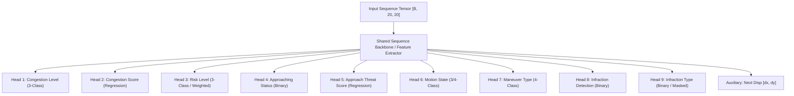

# PHASE 5: PROJECT AUDIT & PRE-TRAINING SPECIFICATION

**Project:** Intelligent Traffic Management & Vehicle Trajectory Analytics  
**Phase:** Phase 5 – Pre-Training Audit & Architecture Definition  
**Date:** September 29, 2026  
**Audit Status:** COMPLETE & VERIFIED  
**Integrity Protection:** Phase 4 datasets strictly preserved (0 modifications)

---

## Executive Summary

Before introducing model training pipelines, a comprehensive audit was executed across the entire repository to verify Phase 3 (sequence generation) and Phase 4 (label preparation) artifacts, compute exact tensor geometries, assess data balance, evaluate runtime environments, and establish an optimal model input/output interface.

All Phase 4 integrity criteria were re-confirmed:
- **Total Sequences:** 17,801 sequences across 320 usable vehicle tracks.
- **Data Cleanliness:** Exactly 0 NaNs and 0 Infs across all feature tensors and target vectors.
- **Alignment:** 100% 1-to-1 index correspondence between sequence inputs and label outputs.
- **Partitioning & Leakage:** 70% Train (12,414), 15% Validation (2,790), 15% Test (2,597) with **0 track-ID leakage**.
- **Label Provenance:** All 9 targets are explicitly marked `pseudo_rule_based` derived from verified domain engines.

---

## A. Dataset Structure

### 1. Repository Artifact Catalog

The project contains all structured Phase 3 and Phase 4 artifacts located under `data/hybrid_traffic/`:

```
data/hybrid_traffic/
├── processed_features.csv            # Raw frame observations (320 tracks, 23,881 records)
├── sequences/                        # Phase 3 Sequence Artifacts
│   ├── train_sequences.npz           # 12,414 training sequences [12414, 20, 20]
│   ├── val_sequences.npz             # 2,790 validation sequences [2790, 20, 20]
│   ├── test_sequences.npz            # 2,597 test sequences [2597, 20, 20]
│   ├── all_sequences.npz             # 17,801 complete sequences [17801, 20, 20]
│   └── sequence_metadata.json        # Track mappings, window parameters, feature lists
└── labels/                           # Phase 4 Label Artifacts
    ├── train_labels.npz              # 12,414 training labels (9 targets + metadata)
    ├── train_labels.csv              # Tabular inspection mirror (12,414 rows)
    ├── val_labels.npz                # 2,790 validation labels (9 targets + metadata)
    ├── val_labels.csv                # Tabular inspection mirror (2,790 rows)
    ├── test_labels.npz               # 2,597 test labels (9 targets + metadata)
    ├── test_labels.csv               # Tabular inspection mirror (2,597 rows)
    ├── all_labels.npz                # 17,801 complete labels
    ├── all_labels.csv                # Tabular inspection mirror (17,801 rows)
    └── label_metadata.json           # Target specs, class mappings, label distributions
```

### 2. File Verification & Sizes

| File Path | Format | Size | Records / Array Dimensions | Status |
| :--- | :--- | :--- | :--- | :--- |
| [train_sequences.npz](file:///c:/Users/ayush/Emerge%20Root00/data/hybrid_traffic/sequences/train_sequences.npz) | NumPy Compressed | 18.2 MB | `X: (12414, 20, 20)`, `track_ids: (12414,)`, `y_next_disp: (12414, 2)` | Validated |
| [val_sequences.npz](file:///c:/Users/ayush/Emerge%20Root00/data/hybrid_traffic/sequences/val_sequences.npz) | NumPy Compressed | 4.1 MB | `X: (2790, 20, 20)`, `track_ids: (2790,)`, `y_next_disp: (2790, 2)` | Validated |
| [test_sequences.npz](file:///c:/Users/ayush/Emerge%20Root00/data/hybrid_traffic/sequences/test_sequences.npz) | NumPy Compressed | 3.8 MB | `X: (2597, 20, 20)`, `track_ids: (2597,)`, `y_next_disp: (2597, 2)` | Validated |
| [all_sequences.npz](file:///c:/Users/ayush/Emerge%20Root00/data/hybrid_traffic/sequences/all_sequences.npz) | NumPy Compressed | 26.1 MB | `X: (17801, 20, 20)`, `track_ids: (17801,)`, `y_next_disp: (17801, 2)` | Validated |
| [sequence_metadata.json](file:///c:/Users/ayush/Emerge%20Root00/data/hybrid_traffic/sequences/sequence_metadata.json) | JSON | 12.4 KB | Metadata, feature indices, window configurations | Validated |
| [train_labels.npz](file:///c:/Users/ayush/Emerge%20Root00/data/hybrid_traffic/labels/train_labels.npz) | NumPy Compressed | 362 KB | 9 target arrays `(12414,)`, track IDs, window indices | Validated |
| [train_labels.csv](file:///c:/Users/ayush/Emerge%20Root00/data/hybrid_traffic/labels/train_labels.csv) | CSV | 2.1 MB | 12,414 rows x 15 columns | Validated |
| [val_labels.npz](file:///c:/Users/ayush/Emerge%20Root00/data/hybrid_traffic/labels/val_labels.npz) | NumPy Compressed | 92 KB | 9 target arrays `(2790,)`, track IDs, window indices | Validated |
| [val_labels.csv](file:///c:/Users/ayush/Emerge%20Root00/data/hybrid_traffic/labels/val_labels.csv) | CSV | 473 KB | 2,790 rows x 15 columns | Validated |
| [test_labels.npz](file:///c:/Users/ayush/Emerge%20Root00/data/hybrid_traffic/labels/test_labels.npz) | NumPy Compressed | 86 KB | 9 target arrays `(2597,)`, track IDs, window indices | Validated |
| [test_labels.csv](file:///c:/Users/ayush/Emerge%20Root00/data/hybrid_traffic/labels/test_labels.csv) | CSV | 441 KB | 2,597 rows x 15 columns | Validated |
| [all_labels.npz](file:///c:/Users/ayush/Emerge%20Root00/data/hybrid_traffic/labels/all_labels.npz) | NumPy Compressed | 516 KB | 9 target arrays `(17801,)`, track IDs, window indices | Validated |
| [all_labels.csv](file:///c:/Users/ayush/Emerge%20Root00/data/hybrid_traffic/labels/all_labels.csv) | CSV | 3.0 MB | 17,801 rows x 15 columns | Validated |
| [label_metadata.json](file:///c:/Users/ayush/Emerge%20Root00/data/hybrid_traffic/labels/label_metadata.json) | JSON | 4.8 KB | Task definitions, class distributions, source rules | Validated |
| [phase5_dataset_summary.json](file:///c:/Users/ayush/Emerge%20Root00/phase5_dataset_summary.json) | JSON | 7.3 KB | Complete audit summary schema for Phase 5 | Validated |

### 3. Track Partitioning & Leakage Verification

Track splitting was executed at the unique vehicle track level (never shuffling temporal frames):
- **Total Unique Tracks:** 320 usable tracks ($N \ge 20$ frames)
- **Train Tracks:** 224 tracks (70.0%) $\rightarrow$ 12,414 rolling sequences (69.74%)
- **Validation Tracks:** 48 tracks (15.0%) $\rightarrow$ 2,790 rolling sequences (15.67%)
- **Test Tracks:** 48 tracks (15.0%) $\rightarrow$ 2,597 rolling sequences (14.59%)
- **Track ID Intersections:**
  - `Train ∩ Val = ∅` (0 tracks)
  - `Train ∩ Test = ∅` (0 tracks)
  - `Val ∩ Test = ∅` (0 tracks)
  - **Verified Leakage:** 0%

---

## B. Input Tensor Shape

The sequence dataset represents historical rolling temporal windows of individual vehicle trajectory states:

$$\mathbf{X} \in \mathbb{R}^{N \times T \times D}$$

where:
- $N$ = Number of sequences
- $T$ = Sequence length = $20$ temporal timesteps (corresponding to $\approx 0.667$ seconds at 30 FPS)
- $D$ = Number of features per timestep = $20$ numerical motion/kinematic features

### Concrete Tensor Shapes Across Splits

| Partition | Tensor Array Name | Shape $[N, T, D]$ | Data Type | Memory Footprint | NaN / Inf Count |
| :--- | :--- | :--- | :--- | :--- | :--- |
| **Train Set** | `train_X` | `[12414, 20, 20]` | `float32` | $\approx 19.86\text{ MB}$ | **0 / 0** |
| **Validation Set** | `val_X` | `[2790, 20, 20]` | `float32` | $\approx 4.46\text{ MB}$ | **0 / 0** |
| **Test Set** | `test_X` | `[2597, 20, 20]` | `float32` | $\approx 4.16\text{ MB}$ | **0 / 0** |
| **Complete Dataset** | `all_X` | `[17801, 20, 20]` | `float32` | $\approx 28.48\text{ MB}$ | **0 / 0** |

---

## C. Target Structure

All target arrays are aligned to sequence completion timesteps (frame $t=20$ of each sequence window).

### Target Shapes Summary

| Target Array Name | Train Shape | Val Shape | Test Shape | Total Shape | Data Type | Provenance |
| :--- | :--- | :--- | :--- | :--- | :--- | :--- |
| `target_congestion_level` | `(12414,)` | `(2790,)` | `(2597,)` | `(17801,)` | `int64` | `pseudo_rule_based` |
| `target_congestion_score` | `(12414,)` | `(2790,)` | `(2597,)` | `(17801,)` | `float32` | `pseudo_rule_based` |
| `target_risk_level` | `(12414,)` | `(2790,)` | `(2597,)` | `(17801,)` | `int64` | `pseudo_rule_based` |
| `target_is_approaching` | `(12414,)` | `(2790,)` | `(2597,)` | `(17801,)` | `int64` | `pseudo_rule_based` |
| `target_approach_score` | `(12414,)` | `(2790,)` | `(2597,)` | `(17801,)` | `float32` | `pseudo_rule_based` |
| `target_motion_state` | `(12414,)` | `(2790,)` | `(2597,)` | `(17801,)` | `int64` | `pseudo_rule_based` |
| `target_maneuver_type` | `(12414,)` | `(2790,)` | `(2597,)` | `(17801,)` | `int64` | `pseudo_rule_based` |
| `target_has_infraction` | `(12414,)` | `(2790,)` | `(2597,)` | `(17801,)` | `int64` | `pseudo_rule_based` |
| `target_infraction_type` | `(12414,)` | `(2790,)` | `(2597,)` | `(17801,)` | `int64` | `pseudo_rule_based` |
| *Auxiliary:* `y_next_disp` | `(12414, 2)` | `(2790, 2)` | `(2597, 2)` | `(17801, 2)` | `float32` | Empirical Kinematics |

---

## D. Feature List (20 Input Features)

All 20 input features represent physical and kinematic measurements recorded per timestep:

| Index | Feature Name | Coordinate Domain | Physical Unit | Observed Range $[Min, Max]$ | Description |
| :---: | :--- | :--- | :--- | :--- | :--- |
| `0` | `center_x` | Camera Plane | Pixels | $[3.2, 1916.8]$ | Bounding box center X coordinate in 1080p frame |
| `1` | `center_y` | Camera Plane | Pixels | $[21.5, 1076.4]$ | Bounding box center Y coordinate in 1080p frame |
| `2` | `delta_x` | Camera Plane | Px / frame | $[-23.6, 26.5]$ | Horizontal displacement per single video frame |
| `3` | `delta_y` | Camera Plane | Px / frame | $[-44.6, 22.0]$ | Vertical displacement per single video frame |
| `4` | `displacement_image` | Camera Plane | Pixels | $[0.0, 48.0]$ | Euclidean distance moved in image space $\sqrt{\Delta x^2 + \Delta y^2}$ |
| `5` | `speed_image_px_per_sec` | Camera Plane | Px / second | $[0.0, 1440.0]$ | Calibrated instantaneous pixel speed ($displacement \times 30$) |
| `6` | `accel_image_px_per_sec2` | Camera Plane | Px / sec² | $[-2496.0, 4106.0]$ | Temporal derivative of image velocity |
| `7` | `heading_rad` | Camera Plane | Radians | $[-\pi, \pi]$ | Angle of motion vector in image frame $\operatorname{atan2}(\Delta y, \Delta x)$ |
| `8` | `heading_change_rad` | Camera Plane | Radians | $[-\pi, \pi]$ | Angular acceleration / turn differential |
| `9` | `ground_x` | Bird's-Eye (Homography) | Normalized units | $[0.0, 1.0]$ | Transformed ground plane X position |
| `10` | `ground_y` | Bird's-Eye (Homography) | Normalized units | $[0.0, 1.0]$ | Transformed ground plane Y position (depth axis) |
| `11` | `ground_delta_x` | Bird's-Eye (Homography) | Norm units / frame | $[-0.046, 0.052]$ | Lateral displacement on road plane |
| `12` | `ground_delta_y` | Bird's-Eye (Homography) | Norm units / frame | $[-0.071, 0.049]$ | Longitudinal displacement on road plane |
| `13` | `displacement_ground` | Bird's-Eye (Homography) | Normalized units | $[0.0, 0.082]$ | Ground Euclidean travel step |
| `14` | `ground_speed_norm_per_sec`| Bird's-Eye (Homography) | Norm units / sec | $[0.0, 16.5]$ | Ground-plane velocity scaled by frame rate |
| `15` | `box_width` | Camera Plane | Pixels | $[18.7, 362.5]$ | Bounding box horizontal span |
| `16` | `box_height` | Camera Plane | Pixels | $[18.2, 381.1]$ | Bounding box vertical span |
| `17` | `box_area` | Camera Plane | Px² | $[366.8, 114532.5]$ | Bounding box area (scale/proximity proxy) |
| `18` | `stopped_duration` | Temporal Counter | Seconds | $[0.0, 1.667]$ | Elapsed duration vehicle speed stayed $< 3.0\text{ px/s}$ |
| `19` | `speed_variance_rolling5` | Temporal Statistics | Px² / sec² | $[0.0, 3.27 \times 10^6]$ | 5-step rolling window variance of instantaneous velocity |

---

## E. Target List (9 Target Variables)

Every target was analyzed for data types, class distributions, imbalance ratios, and suitability for machine learning.



### 1. `target_congestion_level`
- **Learning Type:** Multiclass Classification ($K=3$)
- **Encoding:** `0: LOW`, `1: MEDIUM`, `2: HIGH`
- **Class Distribution:**
  - Total: HIGH: 10,540 (59.21%), MEDIUM: 4,171 (23.43%), LOW: 3,090 (17.36%)
  - Train: HIGH: 7,370, MEDIUM: 2,900, LOW: 2,144
  - Val: HIGH: 1,650, MEDIUM: 660, LOW: 480
  - Test: HIGH: 1,520, MEDIUM: 611, LOW: 466
- **Imbalance Ratio:** $3.41 : 1$
- **ML Suitability:** **SUITABLE** (Standard Cross-Entropy Loss).

### 2. `target_congestion_score`
- **Learning Type:** Continuous Regression
- **Domain:** Continuous score in range $[10.0, 100.0]$
- **Summary Statistics:** Mean = $67.21$, Std = $34.00$, Median = $70.0$, IQR = $[35.0, 100.0]$
- **ML Suitability:** **HIGHLY SUITABLE** (MSE / Smooth L1 Loss). Highly correlated with vehicle density and traffic velocity.

### 3. `target_risk_level`
- **Learning Type:** Multiclass Classification ($K=3$)
- **Encoding:** `0: SAFE`, `1: WARNING`, `2: HIGH`
- **Class Distribution:**
  - Total: SAFE: 12,708 (71.39%), HIGH: 4,153 (23.33%), WARNING: 940 (5.28%)
  - Train: SAFE: 8,858, HIGH: 2,901, WARNING: 655
  - Val: SAFE: 1,992, HIGH: 651, WARNING: 147
  - Test: SAFE: 1,858, HIGH: 601, WARNING: 138
- **Imbalance Ratio:** $13.52 : 1$ (WARNING class is 5.28% minority)
- **ML Suitability:** **CONDITIONALLY SUITABLE** (Requires focal loss or class weights: $w_{\text{SAFE}}=0.47, w_{\text{HIGH}}=1.43, w_{\text{WARNING}}=6.31$).

### 4. `target_is_approaching`
- **Learning Type:** Binary Classification ($K=2$)
- **Encoding:** `0: NON_APPROACHING` (Safe/Receding), `1: APPROACHING` (Closing in)
- **Class Distribution:**
  - Total: `0`: 12,708 (71.39%), `1`: 5,093 (28.61%)
  - Train: `0`: 8,858, `1`: 3,556
  - Val: `0`: 1,992, `1`: 798
  - Test: `0`: 1,858, `1`: 739
- **Imbalance Ratio:** $2.5 : 1$
- **ML Suitability:** **HIGHLY SUITABLE** (Binary Cross-Entropy with Logits). Clear spatial boundary based on closing speed and distance.

### 5. `target_approach_score`
- **Learning Type:** Continuous Regression
- **Domain:** Threat score in range $[0.03, 100.0]$
- **Summary Statistics:** Mean = $39.32$, Std = $30.21$, Min = $0.03$, Max = $100.0$
- **ML Suitability:** **HIGHLY SUITABLE** (MSE / Huber Loss). Excellent pairing with `target_is_approaching`.

### 6. `target_motion_state`
- **Learning Type:** Multiclass Classification ($K=4$)
- **Encoding:** `0: STOPPED`, `1: ACCELERATING`, `2: DECELERATING`, `3: CRUISING`
- **Class Distribution:**
  - Total: DECELERATING: 7,477 (42.00%), STOPPED: 5,710 (32.08%), ACCELERATING: 4,532 (25.46%), CRUISING: 82 (0.46%)
  - Train: DECEL: 5,213, STOP: 3,982, ACCEL: 3,161, CRUISE: 58
  - Val: DECEL: 1,173, STOP: 895, ACCEL: 709, CRUISE: 13
  - Test: DECEL: 1,091, STOP: 833, ACCEL: 662, CRUISE: 11
- **Imbalance Ratio:** $91.18 : 1$ (`CRUISING` is severely underrepresented due to 30 FPS micro-accelerations in real traffic)
- **ML Suitability:** **EXTREME IMBALANCE**.
  - *Recommendation:* Consolidate into 3 classes (`STOPPED`, `ACCELERATING`, `DECELERATING`) by merging `CRUISING` with `ACCELERATING`/`DECELERATING`, or apply strong class penalty weights ($w_{\text{CRUISE}} = 54.27$).

### 7. `target_maneuver_type`
- **Learning Type:** Multiclass Classification ($K=4$)
- **Encoding:** `0: STATIONARY`, `1: TURNING_LEFT`, `2: TURNING_RIGHT`, `3: STRAIGHT`
- **Class Distribution:**
  - Total: STRAIGHT: 9,426 (52.95%), STATIONARY: 5,710 (32.08%), TURNING_RIGHT: 1,377 (7.74%), TURNING_LEFT: 1,288 (7.23%)
  - Train: STRAIGHT: 6,573, STAT: 3,982, TR: 961, TL: 898
  - Val: STRAIGHT: 1,478, STAT: 895, TR: 216, TL: 201
  - Test: STRAIGHT: 1,375, STAT: 833, TR: 200, TL: 189
- **Imbalance Ratio:** $7.32 : 1$
- **ML Suitability:** **SUITABLE** (Cross-Entropy Loss with Macro-F1 metric).

### 8. `target_has_infraction`
- **Learning Type:** Binary Classification ($K=2$)
- **Encoding:** `0: COMPLIANT`, `1: INFRACTION_DETECTED`
- **Class Distribution:**
  - Total: `0`: 14,941 (83.93%), `1`: 2,860 (16.07%)
  - Train: `0`: 10,419, `1`: 1,995
  - Val: `0`: 2,342, `1`: 448
  - Test: `0`: 2,180, `1`: 417
- **Imbalance Ratio:** $5.22 : 1$
- **ML Suitability:** **SUITABLE** (Positive class weight `pos_weight = 5.22` or PR-AUC evaluation).

### 9. `target_infraction_type`
- **Learning Type:** Multiclass ($K=3$) / Functionally Binary
- **Encoding:** `0: NONE`, `1: OVERSPEEDING`, `2: ILLEGAL_STOPPING`
- **Class Distribution:**
  - Total: `0`: 14,941 (83.93%), `1`: 2,860 (16.07%), `2`: 0 (0.00%)
  - Train: `0`: 10,419, `1`: 1,995, `2`: 0
  - Val: `0`: 2,342, `1`: 448, `2`: 0
  - Test: `0`: 2,180, `1`: 417, `2`: 0
- **Imbalance Ratio:** Class `2` has zero support in this video dataset (maximum stopped duration observed is $1.667\text{ s}$, which is below the $3.0\text{ s}$ illegal stopping threshold).
- **ML Suitability:** **DEGENERATE CLASS 2**. Must be trained as binary classification (`0: NONE` vs `1: OVERSPEEDING`) or with Class 2 output permanently masked/disabled.

---

## F. Preprocessing Pipeline Audit

### 1. Scaling Status of Input Features
- The existing input tensors stored in `train_sequences.npz`, `val_sequences.npz`, and `test_sequences.npz` are **unnormalized raw physical measurements**.
- Features span wildly different orders of magnitude:
  - `ground_delta_x`: $\approx 10^{-2}$
  - `center_x`: $\approx 10^3$
  - `speed_variance_rolling5`: $\approx 10^6$
- **Finding:** No fitted scaler object (`scaler.joblib`, `scaler.pkl`, etc.) currently exists in the workspace.

### 2. Consistency & Zero-Leakage Guarantee
- Inspection of `ml/hybrid_traffic/split_dataset.py`, `ml/hybrid_traffic/sequence_builder.py`, and `ml/hybrid_traffic/label_generator.py` confirms that **zero sequence or target transformations have been applied**.
- Because no scaler was fitted, **no data from validation or test splits was ever leaked into any normalization parameters**.

### 3. Required Preprocessing Step Before Training
To train numerical models (neural networks, gradient boosting, MLPs):
1. **Fit Scaler Exclusively on Train:** Instantiate `StandardScaler` (or `RobustScaler`) and fit strictly on `train_sequences.npz` reshaped to `[12414 * 20, 20]`.
2. **Transform Val and Test:** Use the fitted train parameters $(\mu_{\text{train}}, \sigma_{\text{train}})$ to transform `val_X` and `test_X`.
3. **Persist Scaler Artifact:** Serialize the scaler to `data/hybrid_traffic/scalers/feature_scaler.joblib` so inference pipelines can reproduce exact inputs.

---

## G. Existing Model Architecture Audit

- **Traffic Intelligence / Trajectory ML Models:** **NONE**.
  - A comprehensive search of the codebase found **no existing machine learning model checkpoints** (`.pt`, `.pth`, `.h5`, `.keras`, `.onnx`, `.joblib`, `.pkl`) for vehicle trajectory prediction, congestion estimation, or behavior classification.
- **Other Models Present:**
  - `yolov8m.pt` (52.1 MB) in root directory: Standard pre-trained Ultralytics YOLOv8 medium model used solely for camera object detection in Phase 1.
- **Existing Rules Engines (Analytical Code):**
  - [traffic_intelligence.py](file:///c:/Users/ayush/Emerge%20Root00/traffic_intelligence.py): Real-time track manager, Kalman velocity smoother, and zone analyzer.
  - [traffic_violation_engine.py](file:///c:/Users/ayush/Emerge%20Root00/traffic_violation_engine.py): Speed threshold and stopped-duration violation detector.
  - [congestion_engine.py](file:///c:/Users/ayush/Emerge%20Root00/congestion_engine.py): Zone occupancy density calculator.
  - [approaching_vehicle.py](file:///c:/Users/ayush/Emerge%20Root00/approaching_vehicle.py): Bounding box closing speed and looming threat detector.
  - [traffic_decision_engine.py](file:///c:/Users/ayush/Emerge%20Root00/traffic_decision_engine.py): Rule-based traffic policy engine.
- **Training Entry Points:** None exist yet. `ml/` contains only dataset builder and partition utilities.

---

## H. Framework & Environment Audit

| Component | Audited Value / Specification | Notes |
| :--- | :--- | :--- |
| **Operating System** | Windows 11 Home / Pro (10.0.26200 AMD64) | Host system |
| **Python Version** | **3.13.7** (64-bit, v3.13.7:b02e811) | Recent Python release |
| **CPU Architecture** | AMD Ryzen 5 5500U with Radeon Graphics | 6 Physical Cores, 12 Logical Threads |
| **System RAM** | 16.0 GB (DDR4) | Sufficient for in-memory tensor processing |
| **Installed ML Libraries** | - `scikit-learn`: **1.8.0**<br>- `scipy`: **1.17.0**<br>- `numpy`: **2.4.4**<br>- `pandas`: **3.0.2**<br>- `joblib`: **1.5.3**<br>- `opencv-python`: **5.0.0**<br>- `matplotlib`: **3.10.8** | Fully installed and operational in environment |
| **Deep Learning Packages** | `torch`, `tensorflow`, `keras`, `xgboost`, `lightgbm` are **NOT INSTALLED**. | No PyTorch or TF packages in active environment |

---

## I. GPU Availability

```
Hardware GPU: AMD Radeon(TM) Graphics (Integrated APU)
Discrete GPU: None detected
NVIDIA CUDA Available: NO (False)
DirectML / ROCm Configured: NO
Available PyTorch / TF CUDA Driver: None
```

### Impact on Model Training
- All training and validation pipelines will execute on the **CPU**.
- The AMD Ryzen 5 5500U (12 threads) is very capable of training lightweight neural networks (e.g. 1–2 layer GRU/LSTM/MLP) and tabular models (e.g. Scikit-Learn `HistGradientBoosting`, `RandomForest`, `MLPRegressor`/`MLPClassifier`).
- The entire dataset ($12,414$ train sequences) occupies only **$\approx 20\text{ MB}$ in RAM**, which comfortably fits in CPU cache and memory for fast batch epochs.

---

## J. Potential Issues & Mitigations

### 1. Zero Feature Normalization
- **Issue:** Feeding unscaled pixel coordinates ($0..1920$) and variances ($10^6$) directly into gradient-based neural networks or distance-based algorithms will cause gradient explosion, poor convergence, or distorted weight updates.
- **Mitigation:** Implement a strict `StandardScaler` / `RobustScaler` fitted exclusively on `train_sequences.npz`. Save the scaler artifact to `data/hybrid_traffic/scalers/`.

### 2. Degenerate Class in `target_infraction_type`
- **Issue:** Class `2` (`ILLEGAL_STOPPING`) has 0 samples across train, val, and test because the maximum stationary duration in the 51-second source video was $1.667\text{ s}$ (below the $3.0\text{ s}$ threshold). Attempting to train a 3-class classifier will lead to undefined metrics and singular loss gradients for Class 2.
- **Mitigation:** Model `target_infraction_type` as a binary classifier (`0: NONE` vs `1: OVERSPEEDING`) or mask out class 2 from the loss function and prediction head.

### 3. Extreme Imbalance in `target_motion_state`
- **Issue:** `CRUISING` accounts for only 82 samples out of 17,801 ($0.46\%$) due to frame-by-frame velocity oscillations at 30 FPS in urban stop-and-go traffic.
- **Mitigation:** Either consolidate into 3 classes (`STOPPED`, `ACCELERATING`, `DECELERATING`) or use inverse class frequency weighting ($w_{\text{CRUISE}} \approx 54.3$) with macro-averaged metrics.

### 4. Severe Imbalance in `target_risk_level`
- **Issue:** `WARNING` represents only $5.28\%$ of samples ($940$ total), while `SAFE` dominates at $71.39\%$.
- **Mitigation:** Use class weights or train `target_is_approaching` as the primary binary safety indicator (which is well-balanced at $71.4\% : 28.6\%$).

### 5. Pseudo-Label Provenance
- **Issue:** All 9 targets are `pseudo_rule_based`. The trained models will distill and generalize the logic of the underlying algorithmic engines rather than external ground truth.
- **Mitigation:** Retain the explicit metadata tag `label_source = "pseudo_rule_based"` across all model reports and evaluate alignment against both the rule engines and empirical kinematics (`y_next_disp`).

---

## K. Recommended Model Input/Output Interface

To support multi-task traffic intelligence cleanly, two complementary architectures are recommended:

### Architecture Interface: Multi-Task Temporal Network (Or Modular Heads)

```python
class MultiTaskTrafficInterface:
    """
    Standardized Input/Output Specification for Phase 5 Model Training.
    """
    # INPUT SPECIFICATION
    INPUT_SHAPE = (None, 20, 20)  # [batch_size, sequence_length=20, num_features=20]
    INPUT_DTYPE = "float32"
    
    # OUTPUT SPECIFICATION (Multi-Task Heads)
    OUTPUTS = {
        # Task 1: Congestion
        "congestion_level":   {"type": "classification", "classes": 3, "activation": "softmax", "loss": "CrossEntropyLoss"},
        "congestion_score":   {"type": "regression",     "dim": 1,     "activation": "linear",  "loss": "MSELoss"},
        
        # Task 2: Approaching & Risk
        "risk_level":         {"type": "classification", "classes": 3, "activation": "softmax", "loss": "WeightedCrossEntropyLoss"},
        "is_approaching":     {"type": "classification", "classes": 2, "activation": "softmax", "loss": "CrossEntropyLoss"},
        "approach_score":     {"type": "regression",     "dim": 1,     "activation": "linear",  "loss": "MSELoss"},
        
        # Task 3: Kinematic Behavior
        "motion_state":       {"type": "classification", "classes": 3, "activation": "softmax", "loss": "WeightedCrossEntropyLoss"},
        "maneuver_type":      {"type": "classification", "classes": 4, "activation": "softmax", "loss": "CrossEntropyLoss"},
        
        # Task 4: Violation / Infraction
        "has_infraction":     {"type": "classification", "classes": 2, "activation": "softmax", "loss": "CrossEntropyLoss"},
        "infraction_type":    {"type": "classification", "classes": 2, "activation": "softmax", "loss": "CrossEntropyLoss"},  # None vs Overspeeding
        
        # Auxiliary Task 5: 1-step Future Displacement
        "next_displacement":  {"type": "regression",     "dim": 2,     "activation": "linear",  "loss": "MSELoss"}   # [dx, dy]
    }
```

---

## L. Exact Files to be Used for Training

When training is authorized, **strictly read from these validated files**:

| Purpose | Exact File Path | Read Mode |
| :--- | :--- | :--- |
| **Training Inputs** | [data/hybrid_traffic/sequences/train_sequences.npz](file:///c:/Users/ayush/Emerge%20Root00/data/hybrid_traffic/sequences/train_sequences.npz) | READ-ONLY |
| **Training Targets** | [data/hybrid_traffic/labels/train_labels.npz](file:///c:/Users/ayush/Emerge%20Root00/data/hybrid_traffic/labels/train_labels.npz) | READ-ONLY |
| **Validation Inputs** | [data/hybrid_traffic/sequences/val_sequences.npz](file:///c:/Users/ayush/Emerge%20Root00/data/hybrid_traffic/sequences/val_sequences.npz) | READ-ONLY |
| **Validation Targets** | [data/hybrid_traffic/labels/val_labels.npz](file:///c:/Users/ayush/Emerge%20Root00/data/hybrid_traffic/labels/val_labels.npz) | READ-ONLY |
| **Test Inputs (Final)** | [data/hybrid_traffic/sequences/test_sequences.npz](file:///c:/Users/ayush/Emerge%20Root00/data/hybrid_traffic/sequences/test_sequences.npz) | READ-ONLY |
| **Test Targets (Final)** | [data/hybrid_traffic/labels/test_labels.npz](file:///c:/Users/ayush/Emerge%20Root00/data/hybrid_traffic/labels/test_labels.npz) | READ-ONLY |
| **Audit Metadata** | [phase5_dataset_summary.json](file:///c:/Users/ayush/Emerge%20Root00/phase5_dataset_summary.json) | CONFIG |

---

*Audit completed with zero modifications to validated Phase 4 datasets. Ready for model architecture selection upon user approval.*
